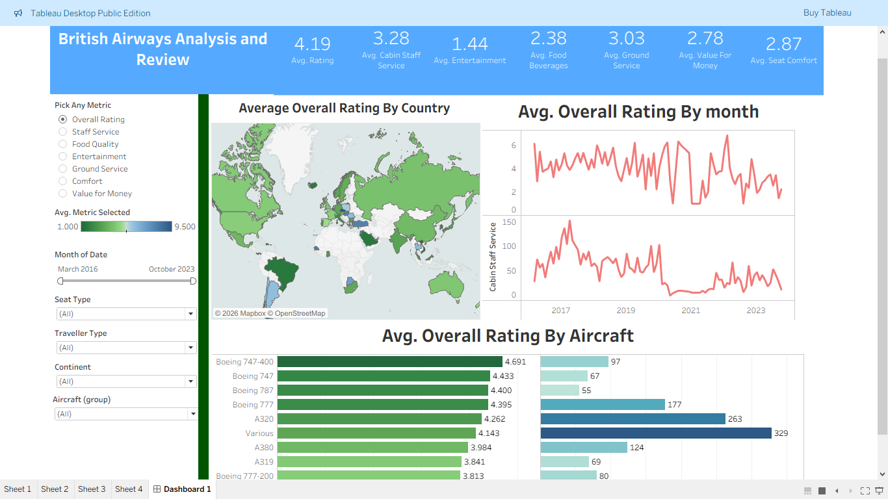

# ✈️ British Airways Customer Experience Dashboard (Tableau)

## 📊 Project Overview

This project presents an interactive Tableau dashboard analyzing customer reviews of British Airways to evaluate overall passenger satisfaction and service quality.

The dashboard enables deep insights into **customer experience across countries, time, aircraft types, and service categories**, helping identify strengths, weaknesses, and opportunities for improvement.

---

## 🎯 Business Problem

Airlines receive large volumes of customer feedback, but extracting actionable insights from this data is challenging.

This project aims to:

* Identify **key drivers of customer satisfaction**
* Detect **underperforming service areas**
* Analyze **trends over time and across regions**
* Support **data-driven decision making**

---

## 📌 Key Dashboard Features

### 📊 KPI Summary (At-a-glance Insights)

* ⭐ Avg Overall Rating: **4.19**
* 🧑‍✈️ Cabin Staff Service: **3.28**
* 🎬 Entertainment: **1.44**
* 🍽️ Food & Beverages: **2.38**
* 🛫 Ground Service: **3.03**
* 💰 Value for Money: **2.78**
* 💺 Seat Comfort: **2.87**

---

### 🌍 Geographic Analysis (Map)

* Displays **average rating by country**
* Helps identify:

  * High satisfaction regions
  * Underperforming markets

---

### 📈 Time Series Analysis

* Monthly trends of:

  * Overall Rating
  * Cabin Staff Service
* Detects:

  * Performance fluctuations
  * Declining or improving service quality

---

### ✈️ Aircraft-wise Performance

* Compares ratings across aircraft models:

  * Boeing 747, 777, 787
  * Airbus A320, A380, etc.
* Identifies aircrafts delivering better customer experience

---

### 🎛️ Dynamic Metric Selection (Advanced Feature)

* Parameter: **"Pick Any Metric"**
* Switch between:

  * Overall Rating
  * Staff Service
  * Food Quality
  * Entertainment
  * Ground Service
  * Comfort
  * Value for Money

👉 Enables flexible, multi-dimensional analysis

---

### 🎚️ Interactive Filters

* Date Range (2016–2023)
* Seat Type
* Traveller Type
* Continent
* Aircraft Group

---

## 📈 Key Insights

* Overall satisfaction is strong (**4.19**), but specific services lag behind
* **Entertainment and food services are the weakest areas**
* Customer satisfaction varies significantly across countries
* Certain aircraft models consistently receive higher ratings
* Ratings fluctuate over time, indicating operational inconsistency
* Value for money and seat comfort indicate scope for improvement

---

## 💼 Business Impact

* Identified **low-performing service areas** (entertainment, food)
* Highlighted **aircraft models with better customer experience**
* Revealed **regional differences in satisfaction levels**
* Enabled **targeted improvements in service quality**
* Supports **strategic decision-making using data insights**

---

## ⚙️ Project Workflow

1. Data collection and preprocessing (CSV dataset)
2. Data cleaning and structuring
3. Creation of calculated fields in Tableau
4. Implementation of **parameter-driven dynamic metric selection**
5. Dashboard design with filters, maps, and interactive visuals
6. Insight generation and storytelling

---

## 🛠️ Tools & Technologies

* Tableau Public (Data Visualization)
* Microsoft Excel / CSV (Data Source)

---

## 📂 Dataset Description

The dataset includes:

* Customer Reviews & Ratings
* Service Metrics (Staff, Food, Entertainment, etc.)
* Date of Review
* Country
* Aircraft Type
* Traveller Type
* Seat Type

---

## 🖼️ Dashboard Preview

---

## ▶️ How to Use

1. Open the live dashboard (Tableau Public link above)
2. Use filters to explore different segments
3. Use **"Pick Any Metric"** to switch analysis
4. Analyze trends across time, geography, and aircraft

---

## 🚀 Future Improvements

* Sentiment analysis using NLP on review text
* Predictive modeling for customer satisfaction
* Comparison with other airlines
* Integration with real-time operational data

---

## 👤 Author

**Priyansh Bobade**
Aspiring Data Analyst | Web Developer

---

## ⭐ Support

If you found this project useful, consider giving it a ⭐ on GitHub!
